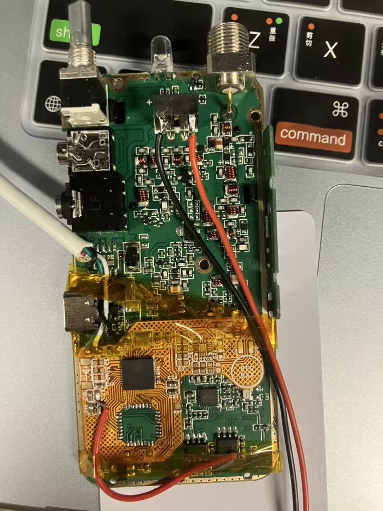
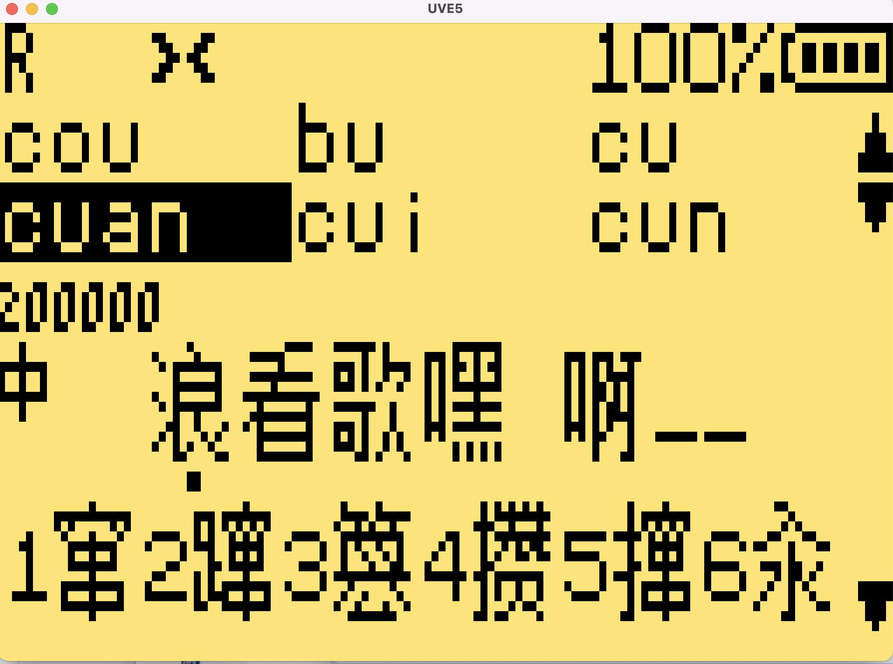

# UVK5 ESP32-S3 固件项目

> 基于 ESP32-S3 的 Quansheng UV-K5 对讲机主控固件

> 硬件在固件测试完成后发布



## 📋 项目简介

本项目将 ESP32-S3 作为 Quansheng UV-K5 对讲机的主控芯片,替代原有的 DP32G030 MCU。通过 ESP32-S3 强大的处理能力和丰富的外设,为 UV-K5 带来以下增强功能:

## 🖥️ OpenCV 仿真环境

本项目提供基于 OpenCV 的上位机仿真环境,用于快速验证显示与界面逻辑。


### 编译与运行

```bash
# 编译
make -C src/app/opencv

# 运行
make -C src/app/opencv run

# 清理
make -C src/app/opencv clean
```

### 说明

- **依赖**: 需要 `glfw3`(通过 `pkg-config` 自动检测),在 macOS/Linux 上确保可用。
- **产物位置**: 可执行文件输出到 `bin/opencv_app`,中间产物在 `build/opencv/`。
- **构建模式**: 默认 `BUILD=debug`,可用 `make -C src/app/opencv BUILD=release` 生成优化版本。

### ✨ 主要特性

- **🌐 NRL 网络音频桥接**: 通过 WiFi 使用 NRL UDP 报文收发 G.711 A-law 语音
- **🕐 RTC 实时时钟**: 精确的时间管理和定时功能
- **📶 WiFi OTA 更新**: 无线固件升级,无需拆机
- **🎛️ 完整的无线电功能**: 保留原版 UV-K5 的所有核心功能
- **🔧 可扩展性**: 基于 Arduino 框架,易于二次开发

## 🌐 NRL 网络音频桥接

当前固件已经内置 NRL 网络音频桥接,用于在射频和网络之间双向转发语音。

### 功能说明

- 通过 WiFi 连接 NRL 服务器,支持直接填写 IPv4 地址或域名
- 网络协议为 `UDP`
- 语音编码为 `G.711 A-law`
- 本地音频格式统一为 `8kHz / 16-bit / Mono`
- 发往网络的语音负载固定为 `160` 字节 G.711 A-law
- 接收网络语音时支持 `160` 到 `500` 字节自适应负载
- 网络来音会在喇叭播放,同时通过射频发射
- 射频收到的音频会在本地喇叭播放,同时发送到 NRL
- 主界面中间行会显示网络对端的 `呼号-SSID`

### NRL 报文实现

- 报文头标识: `NRL2`
- 头长度: `48` 字节
- 语音包类型: `1`
- 心跳包类型: `2`
- 接收端兼容服务器语音类型: `9`
- 心跳间隔默认: `2000ms`
- `CPUID` 字段当前固定为 `0`
- 发包序号字段会随报文递增

### 配置方法

NRL 相关参数位于 [src/lib/nrl_audio_config.h](/home/caocheng/ham/UVE5/src/lib/nrl_audio_config.h):

- `NRL_AUDIO_WIFI_SSID`: WiFi 名称
- `NRL_AUDIO_WIFI_PASSWORD`: WiFi 密码
- `NRL_AUDIO_SERVER_HOST`: NRL 服务器地址,支持 IP 或域名
- `NRL_AUDIO_SERVER_PORT`: 服务器端口
- `NRL_AUDIO_LOCAL_PORT`: 本地 UDP 监听端口,设为 `0` 时可使用系统分配端口
- `NRL_AUDIO_CALLSIGN`: 本机呼号
- `NRL_AUDIO_CALLSIGN_SSID`: 本机 SSID
- `NRL_AUDIO_DEVICE_MODE`: NRL 设备模式字段
- `NRL_AUDIO_HEARTBEAT_INTERVAL_MS`: 心跳周期
- `NRL_AUDIO_RX_PACKET_TIMEOUT_MS`: 网络来音超时判定

### 注意事项

- 当前 NRL 参数仍为编译期宏配置,尚未接入菜单和 EEPROM
- 网络来音时“喇叭播放并同时射频发射”的最终效果仍取决于板级音频硬件连接
- README 中提到的网络音频功能,当前具体实现即为本 NRL UDP 音频桥接

## 🛠️ 硬件平台

- **主控芯片**: ESP32-S3 (双核 Xtensa LX7, 240MHz)
- **无线电芯片**: BK4819 (UHF/VHF 收发器)
- **FM 芯片**: BK1080 (FM 收音机)
- **显示屏**: ST7565 128x64 LCD
- **存储**: I2C EEPROM (配置存储)

## 🚀 快速开始

### 环境要求

- **操作系统**: Windows / macOS / Linux
- **开发工具**: Visual Studio Code
- **Python**: 3.6+ (PlatformIO 依赖)

### 安装 VS Code 和 PlatformIO

#### 1. 安装 Visual Studio Code

前往 [VS Code 官网](https://code.visualstudio.com/) 下载并安装适合你操作系统的版本。

#### 2. 安装 PlatformIO IDE 扩展

1. 打开 VS Code
2. 点击左侧扩展图标 (或按 `Ctrl+Shift+X` / `Cmd+Shift+X`)
3. 搜索 "PlatformIO IDE"
4. 点击 "Install" 安装


#### 3. 等待 PlatformIO 初始化

首次安装时,PlatformIO 会自动下载所需的工具链和依赖包,这可能需要几分钟时间。

### 克隆项目

```bash
git clone https://github.com/losehu/UVE5.git
cd UVE5
```

### 打开项目

1. 在 VS Code 中选择 `File` → `Open Folder`
2. 选择克隆的 `UVE5` 目录
3. PlatformIO 会自动识别 `platformio.ini` 配置文件

### 编译固件

#### 方法 1: 使用 PlatformIO 按钮

1. 点击底部状态栏的 "PlatformIO: Build" 按钮
2. 或者使用快捷键 `Ctrl+Alt+B` / `Cmd+Alt+B`

#### 方法 2: 使用任务菜单

1. 按 `Ctrl+Shift+P` / `Cmd+Shift+P` 打开命令面板
2. 输入 "PlatformIO: Build"
3. 选择环境 `app0_main` 或 `bootmgr_factory`

#### 方法 3: 使用终端

```bash
# 编译主应用程序
platformio run --environment app0_main

# 编译 Bootloader
platformio run --environment bootmgr_factory

# 清理编译输出
platformio run --target clean
```

### 上传固件

#### 通过 USB 串口上传

1. 连接 ESP32-S3 开发板到电脑
2. 点击底部状态栏的 "PlatformIO: Upload" 按钮
3. 或使用命令:

```bash
platformio run --target upload --environment app0_main
```

#### 通过 OTA 无线上传

```bash
platformio run --target upload --upload-port <ESP32_IP地址>
```

## 📁 项目结构

```
UVE5/
├── platformio.ini          # PlatformIO 配置文件
├── boards/                 # 自定义开发板定义
│   └── uvk5.json          # UVK5 ESP32-S3 板级配置
├── src/                    # 源代码目录
│   ├── app/               # 主应用程序固件
│   │   ├── main.cpp       # Arduino 主程序入口
│   │   ├── board.c/h      # 板级初始化
│   │   ├── settings.c/h   # 配置管理
│   │   ├── radio.c/h      # 无线电控制
│   │   ├── audio.c/h      # 音频处理
│   │   ├── app/           # 应用层功能
│   │   │   ├── app.c/h           # 主应用循环
│   │   │   ├── menu.c/h          # 菜单系统
│   │   │   ├── scanner.c/h       # 频率扫描
│   │   │   ├── spectrum.c/h      # 频谱分析
│   │   │   ├── fm.c/h            # FM 收音机
│   │   │   ├── dtmf.c/h          # DTMF 编解码
│   │   │   ├── messenger.c/h     # 消息功能
│   │   │   └── mdc1200.c/h       # MDC1200 协议
│   │   ├── driver/        # 硬件驱动层
│   │   │   ├── bk4819.cpp/h      # BK4819 无线电芯片
│   │   │   ├── bk1080.cpp/h      # BK1080 FM 芯片
│   │   │   ├── st7565.cpp/h      # ST7565 LCD 驱动
│   │   │   ├── backlight.cpp/h   # 背光控制
│   │   │   ├── keyboard.cpp/h    # 键盘输入
│   │   │   ├── eeprom.cpp/h      # EEPROM 存储
│   │   │   ├── i2c.cpp/h         # I2C 通信
│   │   │   ├── adc.cpp/h         # ADC 电池检测
│   │   │   ├── system.cpp/h      # 系统延时
│   │   │   └── uart.cpp/h        # 串口通信
│   │   ├── ui/            # 用户界面
│   │   │   ├── main.c/h          # 主界面
│   │   │   ├── menu.c/h          # 菜单界面
│   │   │   ├── welcome.c/h       # 欢迎界面
│   │   │   ├── status.c/h        # 状态栏
│   │   │   └── battery.c/h       # 电池显示
│   │   └── helper/        # 辅助功能
│   │       ├── battery.c/h       # 电池管理
│   │       └── rds.c/h           # RDS 解码
│   └── bootloader/        # Bootloader 固件
│       └── main.cpp       # Bootloader 主程序
├── lib/                    # 库文件
│   └── shared_flash.h     # 共享 Flash 分区定义
├── src/lib/                # 应用侧附加模块
│   ├── nrl_audio_bridge.cpp/h  # NRL UDP 音频桥接
│   └── nrl_audio_config.h      # NRL 音频配置
└── scripts/                # 辅助脚本
    ├── upload_app0.py     # 上传脚本
    └── serial_monitor.py  # 串口监视器

```

### 核心模块说明

#### 📱 App (应用程序)

位于 `src/app/` 目录,包含对讲机的主要功能实现:

- **主循环**: `main.cpp` - Arduino 风格的 `setup()` 和 `loop()` 函数
- **板级支持**: `board.c` - 硬件初始化,包括 BK4819、LCD、I2C 等
- **无线电控制**: `radio.c` - 频率设置、调制模式、功率控制
- **音频处理**: `audio.c` - 音频路径控制、音量管理
- **设置管理**: `settings.c` - EEPROM 读写、配置参数管理

**应用层功能** (`app/` 子目录):
- 菜单系统、频率扫描、频谱分析
- FM 收音机、DTMF 编解码
- MDC1200 协议支持

**驱动层** (`driver/` 子目录):
- 各硬件芯片的底层驱动实现
- GPIO、I2C、SPI、ADC 等外设控制

**UI层** (`ui/` 子目录):
- 各种界面的绘制逻辑
- 与 ST7565 LCD 交互

#### 🔧 Bootloader (引导加载器)

位于 `src/bootloader/` 目录,负责:

- **固件引导**: 启动主应用程序
- **OTA 支持**: 管理固件分区切换
- **故障恢复**: 检测主应用程序是否有效
- **串口更新**: 通过串口升级固件

## 🔨 编译配置

### PlatformIO 环境

项目定义了两个编译环境:

#### 1. `app0_main` - 主应用程序

```ini
[env:app0_main]
platform = espressif32
board = uvk5
framework = arduino
board_build.partitions = partitions.csv
board_build.filesystem = littlefs
```

**分区布局** (partitions.csv):
- Bootloader: 引导程序分区
- App0: 主应用程序分区 (OTA 分区 0)
- App1: 备用应用程序分区 (OTA 分区 1)
- NVS: 非易失性存储
- LittleFS: 文件系统

#### 2. `bootmgr_factory` - Bootloader

```ini
[env:bootmgr_factory]
platform = espressif32
board = uvk5
framework = arduino
```

### 编译选项

在 `platformio.ini` 中可以配置:

```ini
build_flags =
    -DENABLE_FMRADIO          # 启用 FM 收音机
    -DENABLE_MESSENGER        # 启用消息功能
    -DENABLE_SPECTRUM         # 启用频谱分析
    -DENABLE_DOPPLER          # 启用多普勒功能
```

## 🔌 引脚定义

### ESP32-S3 GPIO 映射

| 功能 | GPIO | 说明 |
|------|------|------|
| BK4819 SCN | GPIO 2 | 片选 |
| BK4819 SCL | GPIO 1 | 串行时钟 |
| BK4819 SDA | GPIO 34 | 串行数据 |
| LCD RST | GPIO 45 | 复位 |
| LCD CS | GPIO 7 | 片选 |
| LCD MOSI | GPIO 4 | 数据 |
| LCD CLK | GPIO 6 | 时钟 |
| LCD A0 | GPIO 5 | 命令/数据 |
| Backlight | GPIO 8 | 背光控制 |
| I2C SDA | GPIO 13 | EEPROM 数据 |
| I2C SCL | GPIO 14 | EEPROM 时钟 |
| ADC Voltage | GPIO 10 | 电池电压检测 |
| ADC Current | GPIO 9 | 电池电流检测 |

## 🐛 常见问题

### 编译错误

**问题**: `undefined reference to xxx`
- **解决**: 检查头文件是否包含 `extern "C"` 包装
- C++ 文件调用 C 函数需要 extern "C" 声明

**问题**: `fatal error: xxx.h: No such file or directory`
- **解决**: 检查 `platformio.ini` 中的 `build_flags` 和 `lib_deps`

**问题**: 上传后设备无法启动
- **解决**: 
  1. 先上传 bootloader
  2. 再上传主应用程序
  3. 检查分区表配置

## 🤝 贡献指南

欢迎提交 Issue 和 Pull Request!

## 📄 许可证

本项目采用 MIT 许可证。详见 [LICENSE](LICENSE) 文件。

## 🙏 致谢

- [Quansheng UV-K5 原版固件](https://github.com/DualTachyon/uv-k5-firmware)
- [Quansheng UV-K5 losehu固件](https://github.com/losehu/uv-k5-firmware-custom)
- [ESP32 Arduino Core](https://github.com/espressif/arduino-esp32)
- PlatformIO 团队

## 📞 联系方式

- **项目主页**: https://github.com/losehu/UVE5
- **Issues**: https://github.com/losehu/UVE5/issues

---

⭐ 如果这个项目对你有帮助,请给个 Star!
